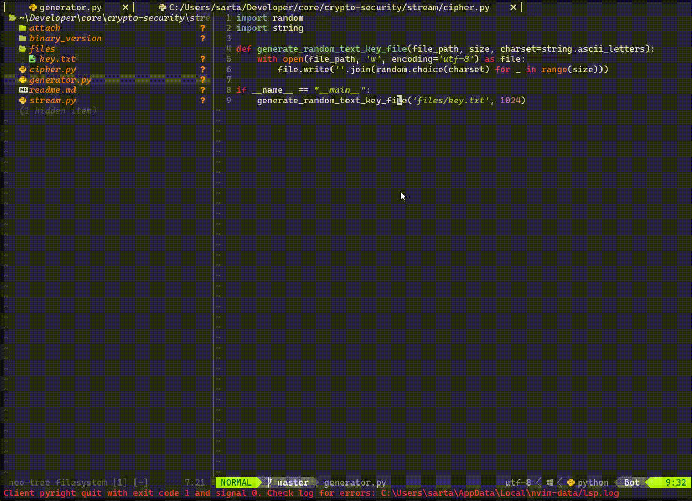

1. Сгенерируйте файл из случайных символов с помощью встроенного ГПСЧ или самостоятельно реализованного линейного конгруэнтного генератора.
   
2. Реализуйте шифр Вернама для зашифрования/расшифрования файла.
   
3. Реализуйте применение любого поточного шифра. Можно написать простой шифр самостоятельно (например, RC4) или взять готовую реализацию из какой-либо криптографической библиотеки.
   
   